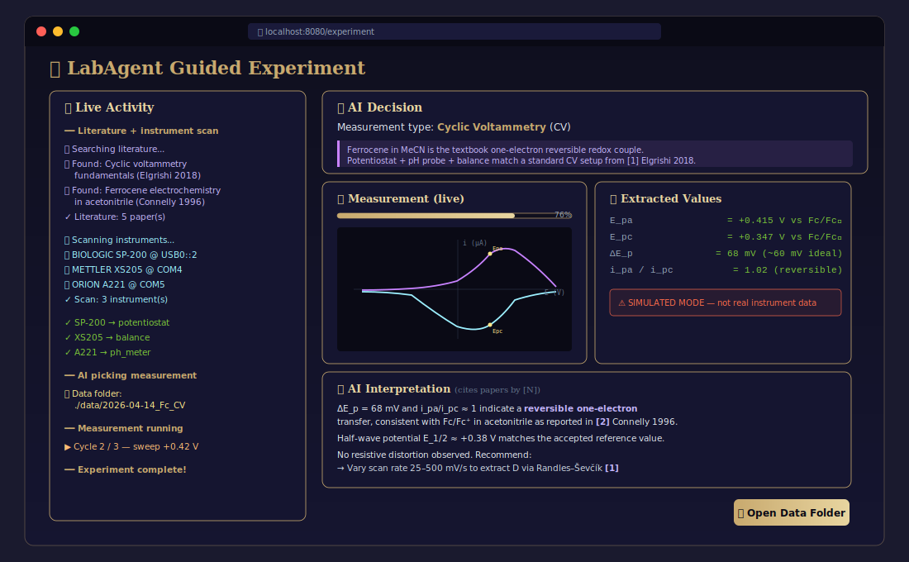
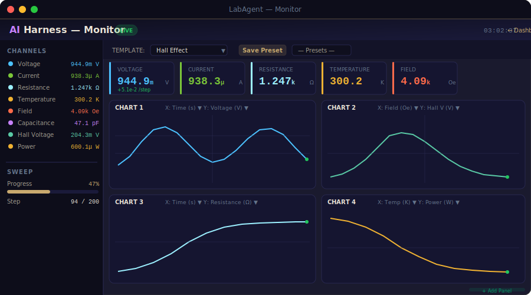

<p align="center">
  
</p>

<p align="center">
  <a href="https://github.com/Anai-Guo/LabAgent/actions/workflows/ci.yml"></a>
  
  
  
  
  
  <a href="LICENSE"></a>
</p>

---

> **Type two things. Get a measurement.** Describe your research direction and sample — LabAgent searches the literature, scans your instruments, picks the measurement, runs it safely, and explains the science (physics, electrochemistry, spectroscopy, whatever fits) with cited references.

## See It In Action

<p align="center">
  
</p>

Every block above is real: live SSE activity stream, AI-picked measurement type with reasoning, live-drawn measurement curve, extracted quantities, and AI interpretation that cites papers by `[N]`. The example above shows a cyclic voltammetry scan on a ferrocene probe — swap in a Keithley or a Keysight scope and you'll see an IV sweep or a waveform instead. **Eight measurement types now run on real instruments** (IV, RT, DELTA, HIGH_R, BREAKDOWN, SEEBECK, TUNNELING, PHOTO_IV — via pymeasure + 3 in-tree VisaDrivers + a Zurich Instruments adapter); other measurement types still fall back to a physics simulator, and every CSV/PNG is clearly marked with which backend produced it.

## Quick Start

```bash
pip install git+https://github.com/Anai-Guo/LabAgent.git
labharness setup    # one-time: pick AI provider, drop API key
labharness web      # opens http://127.0.0.1:8080
```

Then visit **`/experiment`**, type a research direction and material, hit Start.

Prefer terminal?

```bash
labharness start    # same flow, CLI-guided
```

## Why It Exists

Most research labs have powerful instruments and terrible automation software. Researchers burn weeks writing one-off LabVIEW scripts for every new measurement, without safety nets or institutional memory. When a student graduates, the code leaves with them.

LabAgent replaces that with a shared, AI-guided framework. Add a new measurement type by writing a 10-line YAML template. Swap AI providers with one config line. Every experiment gets a timestamped folder with raw data, analysis figures, AI-cited interpretation, and next-step suggestions — organized the same way for everyone on the team.

## Features at a Glance

| Feature | Details |
|---------|---------|
| **46 Measurement Templates** | Ready-to-use YAML templates across 9 scientific disciplines |
| **AI at Every Step** | 8 AI capabilities: classification, optimization, safety advisory, script generation, result interpretation, skill generation, agent chat, experiment memory |
| **Adaptive Web GUI** | Real-time dashboard and multi-panel monitor that dynamically generates forms from templates — no hardcoded pages |
| **6 AI Model Providers** | Claude, GPT-4o, Gemini, Ollama, vLLM, DeepSeek — switch with one config line |
| **Safety-First Design** | 3-tier boundary validation (block / require confirmation / allow) prevents dangerous configurations |
| **Instrument Drivers** | GPIB, USB, and serial instrument scanning with auto-retry and AI-powered classification of unknown devices |
| **Experiment Memory** | SQLite + FTS5 full-text search remembers your successful parameters and learns from history |
| **MCP Server** | Expose all tools to Claude Code, Cursor, or any MCP-compatible AI IDE |

<p align="center">
  
</p>

## Web GUI

Start the adaptive measurement interface with a single command:

```bash
labharness web --port 8080
```

- **Dashboard** (`/`) — Browse all 46 templates grouped by discipline, configure sweep parameters, set safety limits, and generate validated measurement plans
- **Monitor** (`/monitor`) — Multi-panel real-time data display with user-selectable X/Y axes and WebSocket streaming

The GUI dynamically generates measurement forms from YAML templates. Adding a new template file automatically makes it available in the web interface — no frontend code changes needed.

<p align="center">
  
</p>

Key monitor features:
- **4 chart panels** with independently selectable X/Y axes from 17 data channels
- **6 metric cards** that auto-configure based on measurement template
- **Template selector** — switch between AHE, Hall, IV, etc. and the UI reconfigures
- **Save/Load presets** — save your chart layout for each experiment type, restore with one click
- **Real-time sidebar** — live channel values, sweep progress, elapsed time

## Supported Disciplines

| Discipline | Count | Example Measurements |
|-----------|:-----:|---------------------|
| Electrical Characterization | 7 | IV curve, R-T, delta mode, high resistance, FET transfer/output, breakdown |
| Electrochemistry | 4 | Cyclic voltammetry, EIS, chronoamperometry, potentiometry |
| Semiconductor & Optoelectronics | 5 | Solar cell IV, DLTS, photocurrent spectroscopy, photoresponse, tunneling |
| Sensors, Materials & Environmental | 7 | Gas sensor, humidity, impedance biosensor, cell counting, pH calibration, strain gauge, fatigue |
| Dielectric & Ferroelectric | 4 | C-V, P-E loop, pyroelectric current, capacitance-frequency |
| Thermoelectric | 2 | Seebeck coefficient, thermal conductivity |
| Superconductivity | 2 | Tc transition, critical current density (Jc) |
| Magnetic Measurements (condensed-matter) | 8 | Hall effect, magnetoresistance, AHE, SOT loop shift, FMR, hysteresis, magnetostriction, Nernst |
| Quantum Design PPMS/MPMS | 6 | PPMS R-T, PPMS MR, PPMS Hall, PPMS heat capacity, MPMS M-H, MPMS M-T ZFC/FC |

Plus a universal **custom sweep** template for user-defined X-Y measurements (46 total).

## Supported Instruments

Works out of the box with ~50 models from 15+ vendors across all the disciplines above:

| Category | Representative Vendors / Models |
|----------|--------------------------------|
| Source meters, DMMs, electrometers, nanovoltmeters | Keithley 2400, 2000, 2182A, 6221, 6517B |
| Oscilloscopes | Tektronix TDS/MSO, Keysight DSOX/MSOX, Rigol DS/MSO |
| Function generators | Keysight 33500B/33622A, Tektronix AFG, Rigol DG |
| DC power supplies | Keysight E36313A, Rigol DP832A |
| Lock-in amplifiers | SRS SR830/SR860/SR865A, Zurich MFLI/HF2LI |
| Spectrum analyzers & VNAs | Keysight N9320B/E5071C, R&S FSV/ZNA |
| LCR & impedance | Keysight E4980A |
| Optics / photonics | Thorlabs PM100D, LDC205C, MDT693B, Newport 1830-C |
| UV-Vis spectrometers | Ocean Insight USB2000/QEPro, Thorlabs CCS100 |
| Potentiostats (electrochemistry) | BioLogic SP-200/VSP/VMP3, Gamry Reference 600+/1010B, CH Instruments CHI760E, Metrohm Autolab PGSTAT, Palmsens4 |
| Microplate readers (biology) | BMG CLARIOstar, Molecular Devices SpectraMax |
| Balances, pH, ISE | Mettler XS/XP (MT-SICS), Ohaus Adventurer, Thermo Orion A221 |
| Gas / flow / pressure | Alicat MC-series MFCs, MKS PR4000 |
| Temperature control | Lakeshore 335/336/340/350, Oxford Mercury iTC |
| Gaussmeters | Lakeshore 425, 455, 475 |
| DAQ | NI USB-6351/6001/6009 |
| Quantum Design (condensed-matter specialty) | PPMS DynaCool/VersaLab, MPMS3 via MultiPyVu |

Don't see your instrument? The AI calls the `manual_lookup` tool to fetch the manufacturer's programming manual, then classifies from the `*IDN?` response — so truly unknown devices are handled gracefully.

## AI at Every Step

| Capability | How AI Helps |
|-----------|-------------|
| **Instrument Classification** | LLM identifies unknown instruments from `*IDN?` responses and maps them to measurement roles |
| **Parameter Optimization** | Suggests optimal sweep ranges based on your sample type and literature references |
| **Safety Advisory** | Explains *why* a limit exists and suggests safer alternatives when boundaries are hit |
| **Script Generation** | Creates custom analysis scripts with publication-ready plots (PNG 300 dpi + PDF) |
| **Result Interpretation** | Extracts physical quantities and explains them with context |
| **Skill Generation** | Creates new measurement protocol skills from existing examples |
| **Agent Chat** | Multi-turn conversation with tool calling for guided measurement workflows |
| **Experiment Memory** | Learns from your history to improve parameter suggestions for future measurements |

## Choose Your AI Model

One config line switches between cloud and local models:

```yaml
# Best quality (cloud)
model:
  provider: "anthropic"
  model: "claude-sonnet-4-20250514"

# Free & private (local)
model:
  provider: "ollama"
  model: "qwen3:32b"
  base_url: "http://localhost:11434"
```

Supported providers: **Claude** | **GPT-4o** | **Gemini** | **Ollama** | **vLLM** | **DeepSeek**

## CLI Commands

| Command | Description |
|---------|-------------|
| `labharness scan` | Scan for connected instruments via GPIB/USB/serial |
| `labharness classify <type>` | Classify instruments into measurement roles |
| `labharness propose <type>` | Generate a measurement plan with safety validation |
| `labharness literature <type>` | Search literature for measurement protocols |
| `labharness generate-skill <type>` | Generate a new measurement protocol skill with AI |
| `labharness analyze <file>` | Analyze measurement data with AI interpretation |
| `labharness chat` | Interactive AI chat for guided measurement workflows |
| `labharness procedures` | List PICA reference instrument procedures |
| `labharness web` | Start the adaptive Web GUI (dashboard + monitor) |
| `labharness serve` | Start MCP server for AI IDE integration |

## MCP Server Tools

Run as an MCP server for integration with Claude Code, Cursor, or any MCP client:

```bash
labharness serve
```

| Tool | Description |
|------|-------------|
| `scan_instruments` | Discover all connected lab instruments |
| `classify_lab_instruments` | Map instruments to measurement roles |
| `propose_measurement` | Generate a validated measurement plan |
| `validate_plan` | Check a plan against safety boundaries |
| `search_literature` | Find published measurement protocols |
| `analyze_data` | Run analysis with AI interpretation |
| `generate_skill` | Create new measurement protocol skills |
| `healthcheck` | Verify system status and available templates |

## Compared to Alternatives

| | LabAgent | LabVIEW | PyMeasure | PICA | Custom Scripts |
|---|---|---|---|---|---|
| **AI-guided** | Yes (6 providers) | No | No | No | No |
| **Setup time** | Minutes | Weeks | Hours | Hours | Days |
| **Safety checks** | 3-tier auto | Manual | None | Manual | Manual |
| **Templates** | 46 across 9 disciplines | Rebuild each | Code each | ~10 | Code each |
| **Literature search** | Built-in | No | No | No | No |
| **Web GUI** | Adaptive dashboard | Desktop only | No | No | No |
| **MCP integration** | Native | No | No | No | No |
| **Cost** | Free & open source | $$$$ license | Free | Free | Free |
| **Learning curve** | Natural language | Steep | Moderate | Moderate | Steep |

## Architecture

<p align="center">
  
</p>

## Roadmap

- [x] 46 measurement templates across 9 disciplines
- [x] AI-powered instrument classification, parameter optimization, safety advisory
- [x] Agent loop with tool calling and experiment memory
- [x] MCP server for Claude Code / Cursor integration
- [x] Adaptive Web GUI with real-time monitoring
- [x] Quantum Design PPMS/MPMS integration (MultiPyVu)
- [x] Real-time measurement execution — **8 measurement types** (IV, RT,
  DELTA, HIGH_R, BREAKDOWN, SEEBECK, TUNNELING, PHOTO_IV) run on real
  hardware via three backends: pymeasure adapter (~15 models), 3 in-tree
  VisaDrivers (Keithley 2400/6221, Lakeshore 335), and Zurich Instruments
  adapter (MFLI/HF2LI/SHFQA). Remaining types still fall back to the
  simulator.
- [ ] Real execution for remaining types (HALL, MR, AHE, CV, EIS, FMR, …)
- [ ] BioLogic / Gamry / CH Instruments potentiostat wrappers (electrochemistry)
- [ ] Community template marketplace
- [ ] PyPI package release

## Contributing

We are building the future of AI-powered laboratory automation. Whether you work in physics, chemistry, biology, or materials science, your measurement templates and instrument drivers make this project better for everyone.

See [CONTRIBUTING.md](CONTRIBUTING.md) for development setup and [CATALOG.md](CATALOG.md) for the full template catalog with 46 templates and 16 instrument reference procedures.

## Acknowledgments

- Measurement procedures adapted from [PICA](https://github.com/prathameshnium/PICA-Python-Instrument-Control-and-Automation) (MIT License)
- Agent architecture inspired by [Hermes Agent](https://github.com/nousresearch/hermes-agent) patterns

## License

MIT
